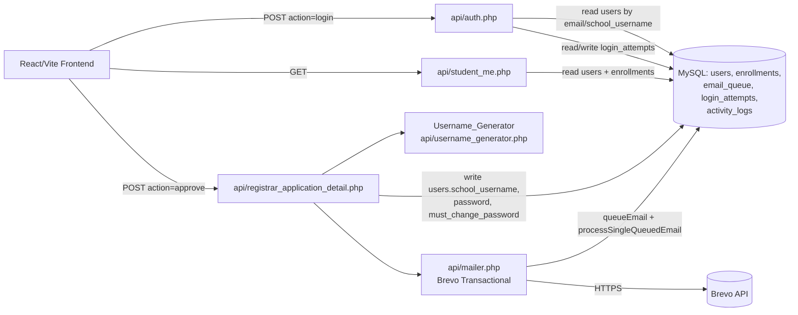
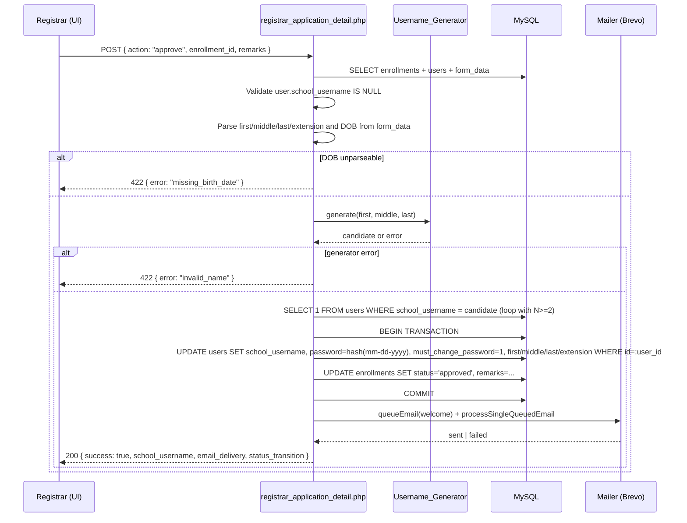
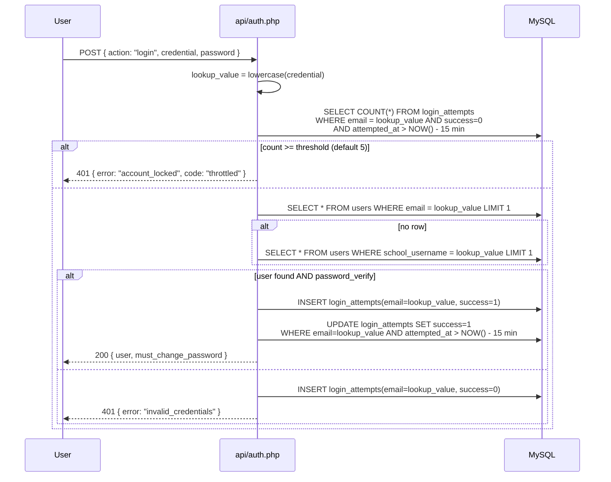

# Design Document

## Overview

This feature, **Student School Credentials**, is the first batch of mentor-feedback work for IntelliDocs (the enrollment system used by Nuestra Senora De Guia Academy). It introduces a first-class identity model for student users and a credential-issuance flow that runs as part of registrar approval.

At a high level, the change does five things:

1. Adds structured name columns (`first_name`, `middle_name`, `last_name`, `extension_name`) and an identity column (`school_username`) and a flag column (`must_change_password`) to the `users` table. All new columns are nullable or default-zero, so the migration is non-breaking.
2. Adds a deterministic `Username_Generator` that derives a `school_username` of the form `{firstInitial}{middleInitial}{lastName}` (lowercased, ASCII, no punctuation), with collision suffixes.
3. Extends `api/registrar_application_detail.php` so the existing `approve` action also issues credentials: it assigns `school_username`, derives the temporary password from the student's date of birth (`mm-dd-yyyy`), hashes it into `users.password`, sets `must_change_password = 1`, and queues a Brevo Welcome_Email containing the school username and the cleartext temporary password.
4. Extends `api/auth.php` so the login endpoint accepts either a personal email or a school username, returns a `must_change_password` flag in successful responses, and applies a per-identifier 5-attempts-per-15-minutes throttle backed by the existing `login_attempts` table.
5. Adds a frontend `First_Login_Guard` that intercepts post-login navigation when `must_change_password = true` and forces the user to a password-change screen, plus a privacy audit that strips student names from any unauthenticated page response.

The change is additive and tolerant: welcome-email delivery failures and downstream status-transition failures must not roll back credential issuance (a warning is surfaced on the response instead).

### Goals

- Predictable, memorable, ASCII-clean school usernames.
- Single-click registrar action: approve + issue credentials + email.
- Login that works with whichever identifier the student remembers.
- Forced password change on first login so the predictable temporary password cannot be reused.
- No leakage of student names on the public web.

### Non-Goals

- Password reset / forgot-password flows. (Out of scope; existing OTP flow is untouched.)
- A separate `personal_email` column. The student's personal email keeps living in `users.email`.
- Multi-factor enrollment for students post-credential issuance.
- Renaming or rotating an already-issued `school_username`.

## Architecture

### Component View



### Request Flow: Approve & Issue Credentials



### Request Flow: Login



### Key Architectural Decisions

| Decision | Rationale |
|---|---|
| Reuse the existing `approve` POST action in `registrar_application_detail.php` rather than introduce a new endpoint. | Keeps the registrar UI's single button mapped to a single backend call. The JSON response is extended with new fields (`school_username`, `email_delivery`, `status_transition`) rather than replaced. |
| Put the `Username_Generator` in a separate file (`api/username_generator.php`) included by both the registrar endpoint and tests. | Pure function, no DB access, easy to property-test in isolation. |
| Reuse the existing `email_queue` table and `processSingleQueuedEmail()` from `api/mailer.php`. | The mailer already supports Brevo. Welcome_Email is just another row with a different subject/body. |
| Reuse the existing `login_attempts` table for throttling. | The schema (`email`, `success`, `attempted_at`, indexed) is already a fit. The throttle key is "the lookup value the user typed", so we store it in the same `email` column whether it's an email or a school username. |
| Run credential issuance and the application status update inside one DB transaction. | Avoids the half-state where the user has a school_username but the application is still "pending". The transaction does *not* include the email send (that's queued separately). |
| Welcome email failure is non-fatal. | Per Requirement 5.4, the registrar response carries a warning rather than an error. The temporary password is recoverable from the student's known DOB if needed. |
| Frontend enforcement of `must_change_password`. | The flag is returned on every login; the React `First_Login_Guard` HOC redirects to `/student/change-password` until cleared. The same flag is also re-checked server-side on protected endpoints by reading `users.must_change_password` to prevent client-side bypass. |
| Public_Page audit happens at the API boundary, not the UI. | Removing the field from the API response makes leakage impossible regardless of which UI consumes it. |

## Components and Interfaces

### 1. `Username_Generator` (`api/username_generator.php`)

Pure PHP function. No DB access.

```php
/**
 * @return array{0: ?string, 1: ?string} [candidate, error]
 *   On success: [string $candidate, null]
 *   On failure: [null, string $errorCode]
 */
function generateSchoolUsername(string $firstName, ?string $middleName, string $lastName): array;

/**
 * Resolve uniqueness against the users table by appending the smallest N>=2.
 * @return string final school_username
 * @throws RuntimeException if no slot found within MAX_COLLISION_ATTEMPTS (defensive).
 */
function resolveSchoolUsernameCollision(PDO $pdo, string $candidate, ?int $excludeUserId = null): string;
```

**Algorithm for `generateSchoolUsername`:**

1. Transliterate each input from UTF-8 to ASCII using `iconv('UTF-8', 'ASCII//TRANSLIT//IGNORE', $name)`. Fallback: strip diacritics manually for environments without iconv (`Ñ` → `N`, `é` → `e`, etc.) using a small lookup map.
2. Lowercase each transliterated string.
3. Strip every character that is not `[a-z]` from each string (this also removes whitespace, hyphens, apostrophes, digits in name fields).
4. Take the first character of `firstName` (`fi`), the first character of `middleName` if non-empty after step 3 (`mi`), and the full `lastName` (`ln`).
5. Concatenate `fi . mi . ln`.
6. If the result is empty, or `fi` is empty, or `ln` is empty, return `[null, 'invalid_name']`.
7. If the result is longer than 32 characters, truncate to 32 characters.
8. Return `[$result, null]`.

**Collision resolution (`resolveSchoolUsernameCollision`):**

1. Try `candidate` first. If no row in `users.school_username` matches, return it.
2. Otherwise, for `N = 2, 3, 4, ...`, try `candidate . N`. If the resulting string would exceed 32 characters, truncate the candidate prefix so the suffix fits.
3. Stop and return the first non-colliding value.
4. As a defensive guard, give up after 1000 attempts and throw `RuntimeException` (this is essentially unreachable in practice but prevents pathological loops).

### 2. `Registrar_API` Extension (`api/registrar_application_detail.php`)

Extend the existing `POST` handler's `approve` branch. The contract becomes:

**Request:**
```json
{ "action": "approve", "enrollment_id": 42, "remarks": "Welcome!" }
```

**Successful response (credentials issued, email sent, status transitioned):**
```json
{
  "success": true,
  "message": "Application approved",
  "school_username": "jmreyes",
  "email_delivery": "sent",
  "status_transition": "approved"
}
```

**Successful response (credentials issued, email failed):**
```json
{
  "success": true,
  "message": "Application approved",
  "school_username": "jmreyes",
  "email_delivery": "failed",
  "status_transition": "approved",
  "warnings": ["welcome_email_not_sent"]
}
```

**Successful response (credentials issued, status update failed afterward):**
```json
{
  "success": true,
  "message": "Credentials issued",
  "school_username": "jmreyes",
  "email_delivery": "sent",
  "status_transition": "failed",
  "warnings": ["status_transition_failed"]
}
```

**Error responses (4xx, no DB write):**

| HTTP | Body |
|---|---|
| 409 | `{ success: false, error: "credentials_already_issued" }` |
| 422 | `{ success: false, error: "missing_birth_date" }` |
| 422 | `{ success: false, error: "invalid_name", details: { reason: "no_ascii_letters" } }` |

**Algorithm:**

1. Validate role (registrar/admin) — already done.
2. Decode payload, look up enrollment by `enrollment_id`, join to `users`.
3. If the enrollment owner already has a non-NULL `school_username`, return 409.
4. Parse `form_data.givenName`, `form_data.middleName`, `form_data.lastName`, `form_data.extensionName` from `enrollments.enrollment_steps`.
5. Parse `form_data.dateOfBirth`. Accept `YYYY-MM-DD`. Reject everything else with 422 `missing_birth_date`. Format the temporary password as `mm-dd-yyyy` per the Glossary (zero-padded month and day).
6. Call `generateSchoolUsername`. On error, return 422 `invalid_name`.
7. Begin DB transaction:
   - Backfill `users.first_name`, `users.middle_name`, `users.last_name`, `users.extension_name`.
   - Resolve collision and write `users.school_username`.
   - Hash temporary password with `password_hash($password, PASSWORD_DEFAULT)`. Write to `users.password`.
   - Set `users.must_change_password = 1`.
   - Try to update `enrollments.status` to `approved` and save `registrar_remarks`.
8. Commit. If the status update raised but credentials were assigned, surface `status_transition: "failed"` with a warning rather than rolling back.
9. Build the Welcome_Email body (plain text, no HTML, see template below). Queue via `queueEmail` and dispatch via `processSingleQueuedEmail`.
10. Append warnings as needed and respond.

**Welcome_Email template (plain text):**

```
Hi {first_name},

Your IntelliDocs school account has been created.

  School username:    {school_username}
  Temporary password: {temporary_password}

You can sign in at https://{app_host}/login using either your personal
email or your school username.

You will be asked to set a new password the first time you sign in.

If you did not expect this email, please contact the registrar's office.

— IntelliDocs / NSDGA
```

**Logging rules:**
- `appLogEvent(action="issue_credentials", status="success", details={ school_username, email_delivery, status_transition })` on every credential issuance.
- The temporary password is **never** included in `details_json`, response payloads, or any log line.

**Defensive schema guards (registrar approve):**

The codebase convention is that every endpoint guards every table reference with `tableExists()` / `columnExists()` before reading or writing. The new `approve` extension follows the same pattern:

1. At the top of `api/registrar_application_detail.php`, immediately after the role check, call `ensureCredentialsSchema($pdo)` (defined in the Migrations subsection). This lazily ALTERs the new columns onto `users` if they are missing.
2. Inside the `approve` branch, before any `UPDATE users SET school_username = ...`, check `columnExists($pdo, 'users', 'school_username')`. If the column is still absent (e.g. ALTER privileges denied to the DB user), short-circuit with a clear, actionable error rather than letting MySQL raise a generic SQL error that surfaces as a 500:

   ```json
   { "success": false, "error": "schema_not_migrated", "details": { "missing": ["users.school_username"] } }
   ```

   HTTP status: **503** (service-unavailable: configuration). The body includes which columns are missing so the operator knows exactly what to fix.
3. Apply the same guard to `users.must_change_password`, `users.first_name`, `users.middle_name`, `users.last_name`, `users.extension_name`, and to `tableExists($pdo, 'enrollments')` (consistent with the existing pattern in `api/student_enrollment.php`). If `enrollments` is absent, return the existing `"Enrollments table is missing. Run student portal migration first."` 500 — this feature does not change that path.
4. The guard runs **before** the DB transaction is opened. No `UPDATE` is attempted on `users` when the schema is not migrated. This is the property covered by Property 18.

### 3. `Auth_API` Extension (`api/auth.php`, `login` action)

The existing `login` action accepts `email`. We extend it to accept `credential` (string), preserving backward compatibility (if `credential` is missing, fall back to `email`).

**Algorithm:**

1. Read `credential` (or `email`) and `password`. Lowercase + trim. Reject with 422 if either is empty.
2. Compute `lookup_value = lowercase(credential)`.
3. Throttle check: count rows in `login_attempts` where `email = lookup_value AND success = 0 AND attempted_at >= NOW() - INTERVAL 15 MINUTE`. If count is `>= AUTH_LOGIN_FAILURE_THRESHOLD` (env var, default 5), insert a failed attempt and return 401 with body `{ success: false, error: "account_locked", code: "throttled", retry_after_seconds: <computed> }`.
4. Lookup user: `SELECT ... FROM users WHERE email = :v LIMIT 1`. If no row, retry with `WHERE school_username = :v LIMIT 1`.
5. If no row, insert failed attempt and return generic 401 `invalid_credentials`.
6. If row found but `password_verify` fails, insert failed attempt and return the same generic 401.
7. If status check fails (existing `inactive` logic), return 403 (unchanged).
8. On success: insert `login_attempts(email=lookup_value, success=1)`. Then `UPDATE login_attempts SET success = 1 WHERE email = :v AND success = 0 AND attempted_at >= NOW() - INTERVAL 15 MINUTE` to clear the failed-attempt window per Requirement 11.3.
9. Build the response. Add a `must_change_password` boolean derived from `users.must_change_password`.

**Response shape (success):**

```json
{
  "success": true,
  "user": {
    "id": 17,
    "username": "jmreyes",
    "email": "joana@example.com",
    "school_username": "jmreyes",
    "full_name": "Joana M. Reyes",
    "first_name": "Joana",
    "middle_name": "M",
    "last_name": "Reyes",
    "role": "student"
  },
  "must_change_password": true
}
```

**Defensive schema guards (login):**

The login path is hot and runs on every authentication attempt; it must not call `ALTER TABLE` and must not 500 on environments where this feature's migration has not yet run. The auth handler therefore tolerates the absence of the new columns:

1. Before issuing the second lookup (`SELECT ... FROM users WHERE school_username = :v`), the handler checks `columnExists($pdo, 'users', 'school_username')`. If the column is absent, it **skips** the school-username branch entirely and serves the request as if only the email lookup existed. Existing users continue to log in by personal email (Pres.3) without any visible failure.
2. Before reading `users.must_change_password` from the row, the handler checks `columnExists($pdo, 'users', 'must_change_password')`. If the column is absent, the response sets `must_change_password: false` (the safe default — no forced change is enforced for a user whose schema has not been migrated). This matches the migration-time default in Requirement 7.5.
3. The throttle check on `login_attempts` already follows the existing pattern: `tableExists($pdo, 'login_attempts')` is checked, and if the table is missing the throttle is bypassed (security-degrade rather than fail-closed) and the operator is alerted via an `error_log()` line. This behavior is unchanged by this feature.
4. The result of these guards: an environment that has run only the base schema and the student-portal migration but not the credentials migration still serves logins. New behaviors (login-by-school-username, force-change-password) are silently inactive until the migration runs. The registrar approve endpoint, by contrast, is fail-loud (Property 18) because it is the path that needs the new columns to do its job.

### 4. Password Change (`api/student_me.php`, new `change_password` POST action — or a sibling `api/auth.php` action)

**Decision:** add it to `api/auth.php` as `action: "change_password"`, since the user must already be authenticated (X-User-Id header) and the same file already owns password material.

**Request:** `{ action: "change_password", new_password: "..." }` (X-User-Id header required).

**Algorithm:**

1. Resolve actor via `getActorUser`. 401 if missing.
2. Validate `new_password` (length ≥ 8, same rule as registration).
3. `UPDATE users SET password = :hash, must_change_password = 0 WHERE id = :id`.
4. Log `appLogEvent(action="change_password", status="success", actor=$id)`.
5. Return `{ success: true, must_change_password: false }`.

### 5. `Student_API` Adjustment (`api/student_me.php`)

Extend the GET response so the `profile` block prefers `users.first_name|middle_name|last_name|extension_name` when they are non-NULL, and falls back to `enrollment_steps.form_data` when they are NULL (current behavior). Also include `school_username` and `must_change_password` in the response so the frontend can render them on the dashboard / settings.

### 6. `First_Login_Guard` (Frontend)

Implemented as a wrapper around `ProtectedRoute` (see `frontend/src/app/components/ProtectedRoute.tsx`). When the stored `user` has `must_change_password === true`, every authenticated route except `/student/change-password` redirects to that screen. The change-password screen calls `apiFetch('/auth.php', { action: 'change_password', new_password })`, then updates `AuthContext` and navigates to the original target.

### 7. Public Page Privacy

Audit list (no rendering of `users.full_name`, `first_name`, `middle_name`, `last_name`, `extension_name`):

- `frontend/src/app/pages/public/*` — landing, about, admissions, contact, registration, events, strand-info, application form.
- Any unauthenticated `api/*` endpoint that returns user-shaped data must drop those columns.

The audit is enforced in two layers:

1. **Backend:** for every endpoint that has any unauthenticated path (the ones reachable without `X-User-Id`), explicit field allow-lists in the JSON response. No `SELECT *` user fan-out.
2. **Frontend:** placeholder-or-omit policy in public components. A single configurable `PUBLIC_STUDENT_PLACEHOLDER` env value (e.g. `"a current NSDGA student"`) is read at build time. If unset, the public copy omits the reference entirely.

## Data Models

### Migrations and prerequisites

This feature does not create the `enrollments`, `email_queue`, `login_attempts`, or `activity_logs` tables — it consumes them. Operators have hit a runtime error on environments (e.g. fresh InfinityFree imports) that imported `database_setup.infinityfree.sql` from an older snapshot but never ran the student-portal migration: `api/student_enrollment.php` short-circuits with `"Enrollments table is missing. Run student portal migration first."` before any of the new credential code can run. The design therefore documents an explicit run order, the source of every prerequisite table, an idempotency contract, and a lazy self-bootstrap helper that mirrors the pattern already in use elsewhere in the codebase.

#### Prerequisite tables and where they come from

| Table | Created by | Notes |
|---|---|---|
| `users` | `database_setup.infinityfree.sql` (or `database_setup.sql`) | Required base schema. The new credential columns are ALTERed onto this table. |
| `enrollments` | `database_migration_student_portal.sql` | Read by the registrar approve flow to pull `enrollment_steps.form_data`. **This is the table whose absence triggers the observed error.** |
| `email_queue` | `database_setup.infinityfree.sql` (newer snapshots) or `database_migration_email_queue.sql` (legacy) | Welcome_Email is queued here. |
| `login_attempts` | `database_setup.infinityfree.sql` (newer snapshots) or `database_migration_logging.sql` (legacy) | Throttle counter source. |
| `activity_logs` | `database_setup.infinityfree.sql` (newer snapshots) or `database_migration_logging.sql` (legacy) | Audit trail target. |

If any of `email_queue`, `login_attempts`, or `activity_logs` is absent on a target environment, the operator runs `database_migration_logging.sql` and `database_migration_email_queue.sql` (both `CREATE TABLE IF NOT EXISTS`, safe to re-run) to bring the schema up. If `enrollments` is absent, the operator runs `database_migration_student_portal.sql`. None of these are created by this feature's migration.

#### Documented run order

Run the SQL files in this order on every environment. Each file is idempotent (`CREATE TABLE IF NOT EXISTS`, `columnExists`-guarded ALTERs, etc.) so re-running on an already-migrated DB is a no-op.

1. `database_setup.infinityfree.sql` — base schema (`users`, `students`, `documents`, role tables, and on newer snapshots `activity_logs`, `login_attempts`, `email_queue`).
2. `database_migration_logging.sql` — only needed if step 1 was an older snapshot that lacked `activity_logs` / `login_attempts`.
3. `database_migration_email_queue.sql` — only needed if step 1 was an older snapshot that lacked `email_queue`.
4. `database_migration_student_portal.sql` — creates `enrollments` and adds profile columns to `users`. **Required prerequisite for this feature.**
5. `database_migration_credentials.sql` (new, this feature) — adds credential columns and the unique index to `users`.

#### `database_migration_credentials.sql` (new, idempotent)

```sql
USE intellidocs_db;

-- Assumes: users (from base schema) and enrollments (from student portal migration).
-- Safe to re-run. Each ALTER is guarded by an information_schema lookup at the
-- application layer (see ensureCredentialsSchema()); when run as raw SQL,
-- duplicate-column errors are expected on second run and can be ignored.

ALTER TABLE users ADD COLUMN first_name VARCHAR(100) NULL;
ALTER TABLE users ADD COLUMN middle_name VARCHAR(100) NULL;
ALTER TABLE users ADD COLUMN last_name VARCHAR(100) NULL;
ALTER TABLE users ADD COLUMN extension_name VARCHAR(20) NULL;
ALTER TABLE users ADD COLUMN school_username VARCHAR(32) NULL;
ALTER TABLE users ADD COLUMN must_change_password TINYINT(1) NOT NULL DEFAULT 0;

ALTER TABLE users ADD UNIQUE INDEX uniq_users_school_username (school_username);
```

This file ships alongside the existing migrations and is referenced from the README's setup section. It does **not** attempt to create `enrollments`, `email_queue`, `login_attempts`, or `activity_logs`; it assumes the prior steps in the run order have already done so.

#### Idempotency contract

- Every credential ALTER is gated by `columnExists($pdo, 'users', $column)` either at the SQL layer (the operator skips duplicate-column errors) or, preferably, at the application layer via `ensureCredentialsSchema()`.
- The unique index on `school_username` is added under a guarded `INFORMATION_SCHEMA.STATISTICS` check so a second run is a no-op rather than an error.
- No DML touches existing rows: every new column is NULL or `DEFAULT 0`, and no `UPDATE` runs at migration time. This satisfies Requirements 1.5, 3.2, 7.5, and the preservation requirements (Pres.1, Pres.2, Pres.2a).

#### `ensureCredentialsSchema(PDO $pdo)` helper

Mirroring `ensureEnrollmentSchema()` in `api/student_enrollment.php`, this feature adds an `ensureCredentialsSchema(PDO $pdo)` helper in `api/registrar_application_detail.php`. It runs the column-add ALTERs lazily on first invocation if the columns are missing, guarded by `columnExists()`, so a deploy that ships new code without yet running `database_migration_credentials.sql` still recovers on the first registrar approve call.

```php
function ensureCredentialsSchema(PDO $pdo): void
{
    if (!tableExists($pdo, 'users')) {
        return; // Base schema not present; nothing this helper can do.
    }
    $requiredColumns = [
        'first_name'           => 'VARCHAR(100) NULL',
        'middle_name'          => 'VARCHAR(100) NULL',
        'last_name'            => 'VARCHAR(100) NULL',
        'extension_name'       => 'VARCHAR(20) NULL',
        'school_username'      => 'VARCHAR(32) NULL',
        'must_change_password' => 'TINYINT(1) NOT NULL DEFAULT 0',
    ];
    foreach ($requiredColumns as $col => $ddl) {
        if (!columnExists($pdo, 'users', $col)) {
            $pdo->exec("ALTER TABLE users ADD COLUMN {$col} {$ddl}");
        }
    }
    // Unique index on school_username, guarded by information_schema.
    $hasIndex = (bool)$pdo->query(
        "SELECT 1 FROM information_schema.statistics
         WHERE table_schema = DATABASE()
           AND table_name = 'users'
           AND index_name = 'uniq_users_school_username'
         LIMIT 1"
    )->fetchColumn();
    if (!$hasIndex && columnExists($pdo, 'users', 'school_username')) {
        $pdo->exec('ALTER TABLE users ADD UNIQUE INDEX uniq_users_school_username (school_username)');
    }
}
```

`ensureCredentialsSchema()` is called once at the top of `api/registrar_application_detail.php`, immediately after the existing role check and before any handler dispatches. It is **not** called from `api/auth.php`: the auth path only reads `users.school_username` and tolerates its absence (see "Defensive guards" in Components and Interfaces) rather than mutating schema on a hot login path.

### Existing tables reused

- `enrollments` — read-only for `enrollment_steps.form_data`. Status transition reuses the existing `approve` path.
- `email_queue` — Welcome_Email is one more row, subject `"Welcome to IntelliDocs — Your School Account"`, plain text body.
- `login_attempts` — already indexed on `email`, `success`, `attempted_at`. The `email` column will hold the lookup value the user typed (either an email or a school_username) for throttling purposes.
- `activity_logs` — `action="issue_credentials"`, `module="registrar"`. Also `action="change_password"`, `module="auth"`.

### TypeScript types (`frontend/src/app/context/AuthContext.tsx`)

```ts
export interface AuthUser {
  id: number;
  username: string;
  email: string;
  school_username?: string | null;
  full_name?: string;
  first_name?: string;
  middle_name?: string;
  last_name?: string;
  extension_name?: string;
  role: 'student' | 'registrar' | 'admin';
  must_change_password?: boolean;
}
```

### Environment variables

| Var | Default | Used by |
|---|---|---|
| `BREVO_API_KEY` | (required for prod) | `api/mailer.php` (already exists) |
| `MAIL_FROM_ADDRESS` | (required) | `api/mailer.php` (already exists) |
| `MAIL_FROM_NAME` | `IntelliDocs` | `api/mailer.php` (already exists) |
| `MAIL_PROVIDER` | `phpmail` | `api/mailer.php` — set to `brevo` in prod |
| `AUTH_LOGIN_FAILURE_THRESHOLD` | `5` | `api/auth.php` |
| `AUTH_LOGIN_FAILURE_WINDOW_MINUTES` | `15` | `api/auth.php` |
| `APP_PUBLIC_URL` | (required) | Welcome email body |


## Correctness Properties

*A property is a characteristic or behavior that should hold true across all valid executions of a system — essentially, a formal statement about what the system should do. Properties serve as the bridge between human-readable specifications and machine-verifiable correctness guarantees.*

The following properties cover the testable acceptance criteria after consolidation. Each property is universally quantified, deterministic, and implementable as a property-based test using a PHP PBT library (Eris) for backend logic and `fast-check` for any frontend pure-function tests.

### Property 1: Username structure follows the initials-plus-lastname rule

*For any* triple `(firstName, middleName, lastName)` for which the `Username_Generator` returns a non-error result, the output equals `lower(translit(firstName))[0] + (middleName !== "" ? lower(translit(middleName))[0] : "") + strip_non_letters(lower(translit(lastName)))`, truncated to at most 32 characters.

**Validates: Requirements 2.1**

### Property 2: Username output shape invariant

*For any* triple `(firstName, middleName, lastName)` for which the `Username_Generator` returns a non-error result, the output `u` satisfies `1 <= length(u) <= 32` and `u` matches the regular expression `/^[a-z][a-z0-9]*$/`. Whenever `length(u) >= 2`, `u` additionally matches `/^[a-z][a-z0-9]{0,30}[a-z0-9]$/`.

**Validates: Requirements 2.2, 2.3, 2.5**

### Property 3: Username generator rejects letter-free inputs

*For any* triple `(firstName, middleName, lastName)` such that the ASCII transliteration of `firstName` or of `lastName` contains no `[a-z]` character, the `Username_Generator` returns the error tuple `[null, 'invalid_name']` and assigns nothing.

**Validates: Requirements 2.4**

### Property 4: Username generator is deterministic

*For any* triple `(firstName, middleName, lastName)`, two consecutive invocations of the `Username_Generator` produce equal results (both either the same candidate string or the same error code).

**Validates: Requirements 2.6**

### Property 5: Collision resolver picks the smallest unused suffix and preserves global uniqueness

*For any* set `S` of currently-used `school_username` values and any candidate `c`, `resolveSchoolUsernameCollision(S, c)` returns a value `r` such that `r ∉ S` and either `r == c` (when `c ∉ S`) or `r == c + N` for the smallest integer `N >= 2` with `c + N ∉ S`. Furthermore, *for any* sequence of `Approve & Issue Credentials` operations on a fresh `users` table, the resulting set of non-NULL `school_username` values has no duplicates.

**Validates: Requirements 3.3, 3.4**

### Property 6: Student_API name selection prefers `users.*` when non-NULL, otherwise `form_data`

*For any* `(user_row, enrollment_form_data)` pair, the `Student_API` profile response field `first_name` (and analogously `middle_name`, `last_name`, `extension_name`) equals `user_row.first_name` whenever `user_row.first_name` is non-NULL, and equals `enrollment_form_data.givenName` (analogously for the others) when `user_row.first_name` is NULL. Equivalently, the backfill from `form_data` is a round-trip: writing then reading via the API returns the original form values when `users.first_name` is non-NULL.

**Validates: Requirements 1.2, 1.3, 1.4**

### Property 7: Credential issuance round-trip

*For any* `(user_row, enrollment, form_data)` where `user_row.school_username` is NULL, `form_data` contains non-empty name parts producing a valid candidate, and `form_data.dateOfBirth` is a valid `YYYY-MM-DD` string, after a successful `approve` action all of the following hold simultaneously: `users.school_username` equals `resolveSchoolUsernameCollision(S, generateSchoolUsername(form_data.givenName, form_data.middleName, form_data.lastName))` where `S` is the set of `school_username` values present before the call; `password_verify(format_dob_as_mmddyyyy(form_data.dateOfBirth), users.password)` returns `true`; `users.must_change_password` equals `1`; the subsequent login response for that user includes `must_change_password: true`; and `enrollments.status` equals `approved` unless the response carries the `status_transition_failed` warning (covered by Property 9).

**Validates: Requirements 4.2, 4.3, 4.4, 7.1, 7.4**

### Property 8: Issuance error preserves state

*For any* `(user_row, enrollment, form_data)` such that at least one of the following holds — `user_row.school_username` is non-NULL, `form_data.dateOfBirth` is not a valid `YYYY-MM-DD`, or `generateSchoolUsername(...)` returns an error — invoking `approve` returns a 4xx response and leaves `users.school_username`, `users.password`, `users.must_change_password`, and `enrollments.status` byte-for-byte equal to their pre-call values.

**Validates: Requirements 4.3, 4.5, 4.6**

### Property 9: Downstream failures do not roll back credentials

*For any* `(user_row, enrollment, form_data)` that satisfies the preconditions of Property 7, when the post-credential status update or the welcome-email send is forced to fail, the response is `success: true` with a `warnings` array containing `status_transition_failed` or `welcome_email_not_sent` respectively, and the credential fields (`users.school_username`, `users.password`, `users.must_change_password`) match the values they would have taken on a fully-successful run.

**Validates: Requirements 4.4, 5.4**

### Property 10: Welcome email body contains required pieces and is plain text

*For any* triple `(first_name, school_username, temporary_password)` rendered into the Welcome_Email template, the resulting body string contains `first_name` as a substring, contains `school_username` as a substring, contains `temporary_password` as a substring, contains a login-instructions phrase (the configured marker, e.g. `"sign in"`), contains at least one `\n`, and contains no substring matching the regex `/<[a-zA-Z][^>]*>/` (i.e., no HTML tags).

**Validates: Requirements 5.2, 5.3, 9.3**

### Property 11: Temporary password is never persisted outside the email

*For any* `(user_row, enrollment, form_data)` that triggers a credential issuance, after the request completes, the formatted temporary password substring `format_dob_as_mmddyyyy(form_data.dateOfBirth)` does not appear in the JSON response body of the registrar API call and does not appear in the `details_json` of any `activity_logs` row produced by the call.

**Validates: Requirements 5.5**

### Property 12: Login by email and login by school_username resolve to the same identity

*For any* user `u` with non-NULL `school_username`, login with `credential = u.email` and the correct password produces a successful response whose `user` payload is structurally equal (excluding non-deterministic fields like `last_login_at`) to the response produced by login with `credential = u.school_username` and the same correct password.

**Validates: Requirements 6.1, 6.2**

### Property 13: Auth failure responses are indistinguishable

*For any* `credential` that is not present in either `users.email` or `users.school_username`, the auth-failed response (status code, body) is equal to the auth-failed response produced when `credential` matches an existing row but `password_verify` fails.

**Validates: Requirements 6.3, 6.4**

### Property 14: Password change is a round trip

*For any* authenticated user `u` and any `new_password` satisfying the system's password rules, after invoking `change_password` with `new_password`, `password_verify(new_password, users.password)` returns `true` and `users.must_change_password` equals `0`.

**Validates: Requirements 7.3**

### Property 15: Login throttle blocks attempts above the threshold within the window

*For any* `lookup_value` and threshold `T = AUTH_LOGIN_FAILURE_THRESHOLD`, after recording `T` failed attempts in the last 15 minutes for that `lookup_value`, every subsequent login attempt for the same `lookup_value` within that window returns the `account_locked` response and does not invoke `password_verify`, regardless of whether the supplied password would otherwise be correct.

**Validates: Requirements 11.1, 11.2, 11.4**

### Property 16: Successful login resets the throttle counter

*For any* `lookup_value` with up to `T - 1` failed attempts in the last 15 minutes, a subsequent successful login causes the count of failed attempts in the window for that `lookup_value` to read as zero, so that the next failed attempt yields `invalid_credentials` rather than `account_locked`.

**Validates: Requirements 11.3**

### Property 17: Public endpoints never expose name fields

*For any* unauthenticated request to any endpoint enumerated in the public-endpoint allow-list, the JSON response tree (recursively, at any depth) contains no key whose name is one of `full_name`, `first_name`, `middle_name`, `last_name`, or `extension_name`.

**Validates: Requirements 8.1, 8.2**

### Property 18: Registrar approve fails closed when the credentials schema is not migrated

*For any* `(user_row, enrollment, form_data)` and any subset `M` of the credential columns (`school_username`, `must_change_password`, `first_name`, `middle_name`, `last_name`, `extension_name`) such that at least one column in `M` is absent from the `users` table at request time, invoking the registrar `approve` action returns a 4xx-or-5xx response (specifically status 503) with body containing `error: "schema_not_migrated"` and a `details.missing` array enumerating exactly the absent columns; furthermore, no `UPDATE` statement is executed against the `users` table during the request, so `users.password`, `users.school_username` (if present), `users.must_change_password` (if present), and `enrollments.status` are byte-for-byte equal to their pre-call values. This property additionally holds when invoked under the `ensureCredentialsSchema()` lazy-bootstrap path: if the helper is unable to add the columns (e.g. the DB user lacks `ALTER` privilege), the same `schema_not_migrated` response is produced rather than a generic 500 from a SQL error.

**Validates: Requirements 1.5, 4.5, 7.5**

## Error Handling

### Backend error categories and HTTP mapping

| Category | HTTP | Body shape | When |
|---|---|---|---|
| Validation (missing/invalid input) | 422 | `{ success: false, error: <code> }` | DOB unparseable, name empty after transliteration, password too short, missing fields |
| Authorization | 403 | `{ success: false, error: "Access denied" }` | Non-registrar/non-admin invokes registrar API, or inactive account on login |
| Authentication | 401 | `{ success: false, error: "Invalid credentials" }` or `{ success: false, error: "account_locked", code: "throttled" }` | Bad credentials, throttle in effect |
| Conflict | 409 | `{ success: false, error: "credentials_already_issued" }` | Approve invoked twice on the same enrollment |
| Schema prerequisite missing | 503 | `{ success: false, error: "schema_not_migrated", details: { missing: ["users.school_username", ...] } }` | One or more new credential columns are absent on `users` and `ensureCredentialsSchema()` could not add them. Registrar approve returns this before opening any transaction or attempting any UPDATE. The auth path does **not** return this — it silently degrades (see "Defensive schema guards (login)"). |
| Server | 500 | `{ success: false, error: <generic> }` | Database error, unexpected exception |

### Idempotency and tolerance

- The credential-issuance branch is **transactionally** all-or-nothing for the user write. The transaction does **not** include the email send. Email failure surfaces as `email_delivery: "failed"` plus a `warnings` array entry.
- The status-transition update is **best-effort** after credentials are committed. A failure surfaces as `status_transition: "failed"` plus a `warnings` array entry. The registrar can retry the status transition via the existing `save_remarks` / `approve` paths since `approve` will short-circuit on the duplicate-issuance check (Property 8) without re-issuing credentials.
- Login throttle uses the existing `login_attempts` table; no new table is introduced. The throttle key (`login_attempts.email`) holds whatever lookup value the user typed, lowercased.

### Logging

- Every credential issuance writes one `activity_logs` row with `action="issue_credentials"`, `module="registrar"`, `target_type="user"`, `target_id=<user_id>`, and `details_json` containing only `school_username`, `email_delivery`, `status_transition`, and `warnings`. The temporary password is never written to logs (Property 11).
- Login attempts continue to use `appLogLoginAttempt` for both successes and failures.

### Frontend error UX

- The "Approve & Issue Credentials" button shows a toast with the resolved `school_username` and email-delivery status on success.
- 409 (`credentials_already_issued`) renders an inline notice: "This applicant already has school credentials."
- 422 (`missing_birth_date`, `invalid_name`) renders a guided message pointing the registrar to the offending field on the application detail.
- A throttled login response shows "Too many failed attempts. Please try again in a few minutes." without exposing the exact threshold.

## Testing Strategy

### Test pyramid

| Layer | Tooling | What it covers |
|---|---|---|
| Backend unit (PHP) | PHPUnit + [Eris](https://github.com/giorgiosironi/eris) for property tests | Username_Generator, password formatting, response builders, throttle logic with a mock PDO/in-memory adapter |
| Backend integration (PHP) | PHPUnit against a disposable MySQL schema | Issuance flow end-to-end (transactional behavior, status transition, mailer mock), login with throttle |
| Frontend unit (TS) | Vitest + React Testing Library + [fast-check](https://github.com/dubzzz/fast-check) | First_Login_Guard routing, public-page placeholder logic, AuthContext hydration |
| Frontend integration | Playwright (smoke level only) | Login → forced password change → dashboard happy path |

### Property-based tests (PBT)

PBT is appropriate for this feature because the username generator, password derivation, login lookup, and throttle logic all have universal behaviors over input spaces that property tests cover better than examples.

**Library choices:**
- PHP: [Eris](https://github.com/giorgiosironi/eris) (or [`giorgiosironi/eris`] on Packagist). It provides `Generator` combinators and an integration with PHPUnit. Each property test runs at minimum 100 iterations (`->limitTo(100)`).
- TypeScript: [`fast-check`](https://fast-check.dev/) v3+. Each property runs `numRuns: 100`.

**Mapping properties → test files:**

| Property | Test file | Iterations |
|---|---|---|
| P1, P2, P3, P4 | `tests/api/UsernameGeneratorPropertyTest.php` | 100 each |
| P5 | `tests/api/CollisionResolverPropertyTest.php` | 100 |
| P6 | `tests/api/StudentMeNameSelectionPropertyTest.php` | 100 |
| P7, P8, P9 | `tests/api/IssueCredentialsPropertyTest.php` (uses an in-memory PDO double) | 100 each |
| P10 | `tests/api/WelcomeEmailRenderingPropertyTest.php` | 100 |
| P11 | `tests/api/IssueCredentialsLeakPropertyTest.php` | 100 |
| P12, P13 | `tests/api/AuthLookupPropertyTest.php` | 100 each |
| P14 | `tests/api/ChangePasswordPropertyTest.php` | 100 |
| P15, P16 | `tests/api/LoginThrottlePropertyTest.php` | 100 each |
| P17 | `tests/api/PublicEndpointsPrivacyPropertyTest.php` (parameterized over the public allow-list) | 100 |
| P18 | `tests/api/SchemaGuardPropertyTest.php` (parameterized over subsets of the credential column set, using a PDO double that reports columns as absent) | 100 |

**Tag format:** every property test file leads with a comment of the form

```
// Feature: student-school-credentials, Property 7: Credential issuance round-trip
```

**Generator notes:**
- `arbitraryName()` for PHP: a chooser over `[ASCII letters, accented Latin letters (Ñ, é, ü, ç), whitespace, hyphen, apostrophe, dot]`, length 1..40.
- `arbitraryDob()`: pick year in `[1990, 2015]`, month in `[1, 12]`, day in `[1, 28]` for safe valid dates; mix in invalid strings for negative cases.
- `arbitraryPassword()`: alphanumeric + symbols, length 8..40 (for valid) and 0..7 (for invalid).
- For PDO-bound tests, use an `InMemoryUsersStore` adapter that implements only the methods our code calls (`prepare`, `execute`, `fetch`, `fetchAll`, `lastInsertId`) to keep iterations fast.

### Example-based and edge-case tests (NOT property tests)

| Requirement | Test type | Notes |
|---|---|---|
| 1.1, 1.5, 3.1, 3.2 (DDL/migration) | SMOKE | Single migration test asserting columns exist and existing rows preserved |
| 3.5 (immutability via UI roles) | EXAMPLE | One test per role |
| 4.1 (button presence) | EXAMPLE | RTL render test |
| 5.1 (mailer wiring) | INTEGRATION | One test per transport (Brevo mock + phpmail mock) |
| 7.2 (First_Login_Guard routing) | EXAMPLE | RTL test with a mock `AuthContext` |
| 8.3, 8.4 (placeholder rendering) | EXAMPLE | RTL tests with placeholder set / unset |
| 9.2 (no `personal_email` column) | SMOKE | information_schema query |
| 11.5 (env override) | EXAMPLE | One test setting `AUTH_LOGIN_FAILURE_THRESHOLD=3` and asserting threshold honored |
| Pres.1, Pres.2, Pres.2a, Pres.3 | SMOKE / EXAMPLE | Migration and seed-account regression tests |

### Running the tests

```bash
# Backend
composer install
vendor/bin/phpunit --testsuite=property --testdox
vendor/bin/phpunit --testsuite=integration --testdox

# Frontend
cd frontend
npm install
npm run test
```

Property tests run in CI with `numRuns: 100` and a fixed seed for reproducibility; failures emit the shrunk counterexample to the build log.

### Manual verification checklist (smoke)

1. **Fresh-database bootstrap.** Drop and recreate `intellidocs_db`. Import only `database_setup.infinityfree.sql`. Confirm only `users` (and its sibling base tables) exist; `enrollments` is absent. Confirm that hitting the registrar approve endpoint returns the existing `"Enrollments table is missing. Run student portal migration first."` 500 (unchanged behavior). Confirm that hitting `api/auth.php` login with the seeded `admin@nsdga.com` still succeeds (Pres.3) — the auth path's defensive guards keep it serving without the new columns.
2. **Documented run order brings the system to a working state.** On the same fresh database, run, in order: `database_migration_logging.sql` (if not already in the base snapshot), `database_migration_email_queue.sql` (if not already in the base snapshot), `database_migration_student_portal.sql`, then `database_migration_credentials.sql`. Confirm `enrollments`, `email_queue`, `login_attempts`, `activity_logs`, and the new `users.school_username` / `users.must_change_password` columns all exist. Re-run every migration a second time and confirm it is a no-op (no errors that block the run, idempotency contract).
3. **Lazy bootstrap.** On a database where step 2's `database_migration_credentials.sql` was *not* run but every prior step was, hit the registrar approve endpoint once. Confirm `ensureCredentialsSchema()` adds the columns transparently and the request succeeds. Re-run the migration script after this and confirm it is still a no-op.
4. **Schema-not-migrated fail-closed.** Revoke `ALTER` on the DB user, drop `users.school_username`, and hit the registrar approve endpoint. Confirm the response is HTTP 503 with `error: "schema_not_migrated"` and `details.missing` listing `users.school_username` — not a 500 from a SQL error (Property 18).
5. Run the migration on a copy of the InfinityFree schema; confirm the new columns exist and existing rows are preserved.
6. Approve a test application as the registrar; confirm the response includes `school_username`, `email_delivery`, and `status_transition`.
7. Confirm the Welcome_Email arrives in the test inbox in plain text with the school username and DOB-formatted password.
8. Log in with the personal email; confirm forced password-change.
9. Log in again with the new password using the school username; confirm dashboard loads with no `must_change_password` flag.
10. Hit the failed-login threshold from a single client; confirm `account_locked`; wait for the window to clear or successful login on a different account; confirm the counter resets after a success.
11. Visit each public page; confirm no student name appears in the rendered HTML or in the network response payloads.
